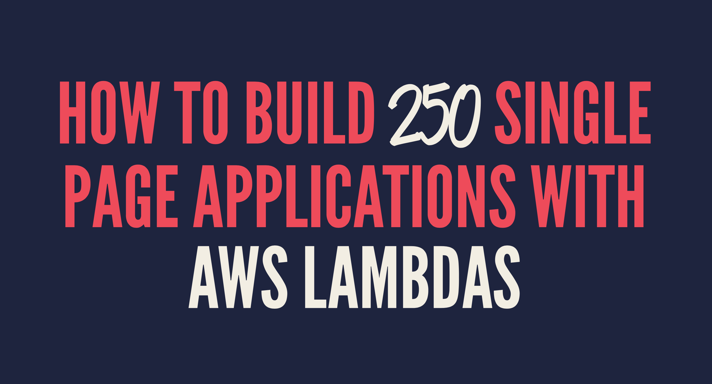

# Talk Slides

At DAZN we rebuilt our Front End system and we had the need for a custom build tool.

This talk will guide you through our serverless build system made of AWS Lambda functions, S3 buckets and more.

## Where I did this talk

- September 27 2017 @ [AWS User Group UK](https://www.meetup.com/AWSUGUK/?_cookie-check=o9OOs_ZtEBRYzgim)  watch [the video on Youtube](https://www.youtube.com/watch?v=8WX0ODMsT2A)