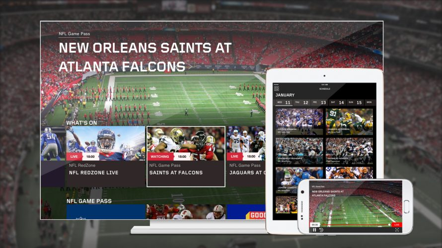

## How to build _**250**_ single page applications with _AWS Lambdas_

^ Hi Everybody, I'm really happy to be here

---

# Who Am I ?

NAME: *Max* [^1] *Gallo*

TWITTER: *@_maxgallo*

SPECS: *Biped*, *Pasta eater*, *Principal Engineer @* DAZN,  *Front-End lover*, *I use spaces - not tabs*

[^1]: or Massimiliano if you like Italian spelling challenges

^ Italian Spelling Challenge
Baiped /ˈbaɪ.ped/

---

#[fit] What I'm going to _**talk**_ about

- Introduction to *DAZN*
- Why we needed a *Build Pipeline*
- How it works
- Takeaways

^ Important understanding the product

---

__*The Netflix of Sport*__
 

- Monthly subscription
- All Sports Included
- Available on any device

^ Launched Aug 2016

^ For DAZN pronunciation, I suggested "EA Sports" Man

---

# _DAZN_ **2.0**
### Multiple _**Single Page Applications**_
### tailored per country and device

^ Minimum amount of code / assets

^ Payments method example

---

# HOW MANY *SPA* ARE WE TALKING ABOUT?

| HOW MANY | WHAT | Seriously, WHAT? |
| --- | --- | --- |
| *1* | *Application* | dazn.com |
| *5* | *Countries* | JP, DE, CA, CH, AT |
| *5* | *Chapters* | catalog, auth, help, … |
| *10* | *Targets* | Web, Mobile, Android Tv, Xbox, Amazon Firestick, …|

We _**just**_ need to build 5 * 5 * 10 = *250 SPA*

---

Are we going to manually create _250 variations of the same app_ ?

---

#[fit] NOPE

---

# The __*Solution*__ should be

 

- Easy to *maintain* and *adopt*
- *Not always on* - It's a build system after all
- *Infrastructure as code*

^ Replicated on different environments

---

 
# [fit] Welcome to: _**The Tube**_

^ Stations

^ "Mind the PR" Slack Channel

---

# [fit] Moving in the _**Tube**_
# *Functional* & *Reactive*

 - Each [^2] *Station* is an *AWS Lambda*
 - Each *Station* is Stateless and Atomic
 - Each *Station* is triggered by event reaction

[^2]: almost each

---

# From _**Code**_ to _**Test & Static Analysis**_

---

# Inside _**Code**_

 

- One repository per *Target*
- *GitHub webhook* to trigger the first step

---

# Inside _**Test & Static Analysis**_

Custom implementation, using *Docker Swarm* and *Bash*
 
1. Checkout target project from GitHub
- Run Unit Tests
- Run Static Analysis
- Compress everything and store it on S3

---

# From _**Test & Static Analysis**_ to _**Prepare**_

---

# Inside _**Prepare**_
 

1. Download the project code from S3
- Magic [^3]
- Pack everything and re-upload to S3

[^3]: You have to trust me on this one

---

# From _**Prepare**_ to _**Build**_

---

# Inside _**Build**_ *Lambda*
 
### It builds the project code, without knowing *how* to build it.
 
1. Download the project code from S3
- Build the project with a generic script (eg. `yarn build`)
- Pack the build output files and upload to S3

---

# From _**Build**_ to _**Optimise**_

---

# Inside _**Optimise**_ *Lambda*
 
### Optimise the build output.
 
1. Download the build output files from S3
- Optimise JavaScript files
- Optimise Html and CSS as well.
- Pack the optimised files and upload them to S3

---

# From _**Optimise**_ to _**Upload**_

---

# Inside _**Upload**_ *Lambda*
 
### Upload the build output.

1. Download the optimised build output files from S3
- Upload the code to Artifactory
- Update Database about new available build

---

# Putting all together
 

---

# Wait !

What about the *250 Single Page Applications* ?

 
---

Truth is, that the _**Tube**_ is more like this

--- 

 

 

# _**Prepare**_ is actually a *Multiplier*

- It saves multiple files on S3
- Multiple events generated
- Multiple lambdas triggered

---

### Instead of *one pipeline*
# We now have *250* of them!

---

# Takeaways

### *Organisational* & *Technical*

---

# *#* Organisational

- Easy learning curve
- *+ Devs* - Ops
- Relatively *low costs*
- You can use different Cloud Vendors

^ Growing team

^ Almost free tier

---

# *#* Tech

- Framework & Language agnostic
- Bounded Context
- Reactive Flow

^ Builder doesn't know how to build 
^ Atomic Build Output
^ No Orchestration

---

# [fit] Thanks

slides: *[github.com/maxgallo/dazn-tube-talk](https://github.com/maxgallo/dazn-tube-talk)*
twitter: *@_maxgallo*
more: *[maxgallo.io](http://maxgallo.io)*

